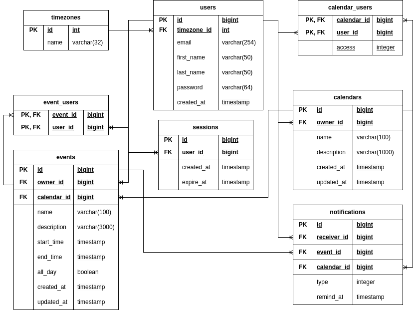
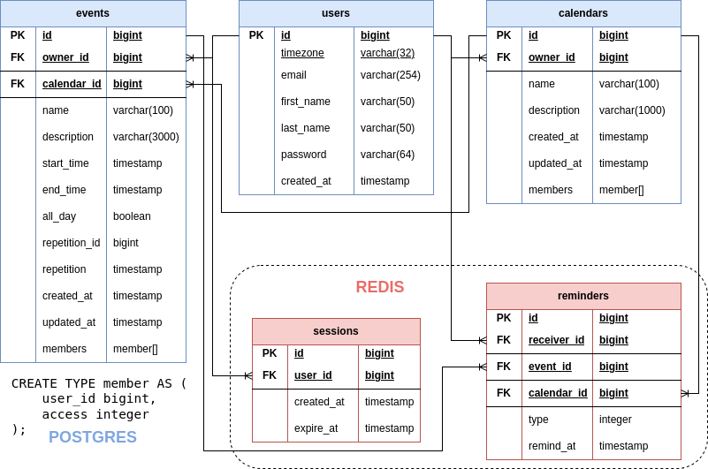
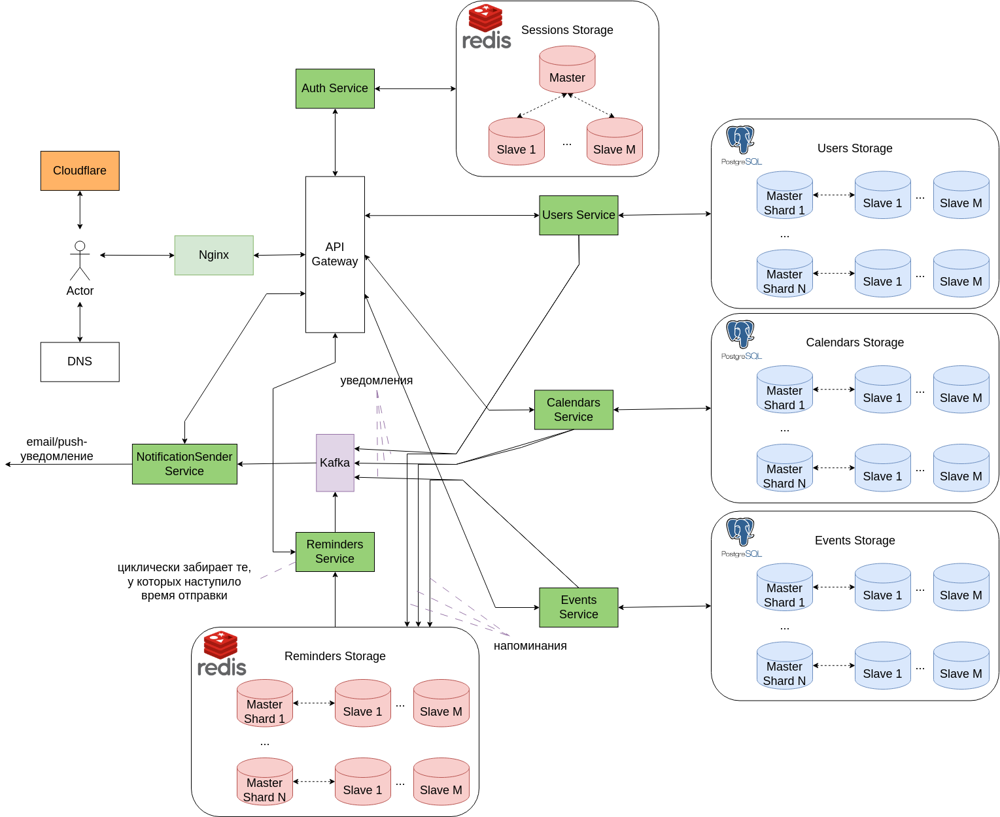

# Google Calendar

[Задание](https://github.com/init/highload/blob/main/homework_architecture.md)

## 1. Тема и целевая аудитория

**Google Calendar** — сервис для планирования встреч, событий и дел, организации рабочего времени.

### MVP

- Регистрация, авторизация.
- Создание, редактирование календарей.
- Каждый календарь можно сделать общедоступным либо предоставить отдельным пользователям права на просмотр и
  редактирование.
- Уведомления и приглашения в календарь по электронной почте.
- Создание, редактирование напоминаний (событий).

### Целевая аудитория

MAU = 500
млн. [[1]](https://www.patronum.io/key-google-workspace-statistics-for-2023/#:~:text=Google%20Calendar%20has%20over%20500%20million%20active%20users%20per%20month.)

Из-за отсутствия информации о DAU, примем его равным 20 млн. пользователей.

#### Географическое распространение [[2]](https://hypestat.com/info/calendar.google.com#:~:text=Visitors%20by%20country,2.8%25)

| Страна   | Процент пользователей от общего числа, % | Количество, млн |
|----------|:----------------------------------------:|:---------------:|
| США      |                  18.8%                   |       94        |
| Индия    |                  10.7%                   |      53.5       |
| Япония   |                   5.2%                   |       26        |
| Россия   |                   2.9%                   |      14.5       |
| Бразилия |                   2.8%                   |       14        | 

## 2. Расчет нагрузки

### Продуктовые метрики

#### Хранилище пользователя

- **Профиль:**
    - email - 254
      байт [[3]](https://www.rfc-editor.org/errata_search.php?rfc=3696&eid=1690#:~:text=the%20upper%0A%20%20%20limit%20on%20address%20lengths%20should%20normally%20be%20considered%20to%20be%20254.)
    - Хэшированный пароль - 64
      байт [[4]](https://www.ory.sh/docs/troubleshooting/bcrypt-secret-length#:~:text=BCrypt%20hashed%20passwords%20and%20secrets%20have%20a%2072%20character%20limit.%20This%20is%20a%20limitation%20of%20the%20BCrypt%20algorithm%20and%20the%20Golang%20BCrypt%20library.)
    - first name + last name - 100
      байт [[5]](https://www.geekslop.com/technology-articles/2016/here-are-the-recommended-maximum-data-length-limits-for-common-database-and-programming-fields#:~:text=35%20chars%20(US)%2C-,50%20(other),-Last%20name)
    - Часовой пояс - 8 байт, ссылка на часовой пояс в таблице часовых поясов
    - **Общий размер:** 254 + 64 + 100 + 4 = 422 байт

- **Календари:**
    - Примем среднее кол-во личных календарей пользователя равным 2.
    - Название - 100 байт.
    - Описание - 1000 байт.
    - Владелец - 8 байт, ссылка на пользователя.
    - Время создания - 8 байт.
    - Время обновления - 8 байт.
    - Размер одного календаря: 100 + 1000 + 8 + 8 + 8 = 1124 байт. // TODO: fix
    - **Общий размер:** 2 * 1124 байт = 2248 байт = 2.2 Kбайт.

- **Подписки на календари:**
    - Примем среднее кол-во подписок на чужие календари равным 3.
    - Календарь - 4 байт, ссылка на календарь.
    - Подписчик - 4 байт, ссылка на пользователя.
    - **Общий размер:** 3 * (4 + 4) = 24 байт.

- **События:**
    - Пусть пользователь в среднем создает 3 события в день. События хранятся долговременно.
    - Тогда за период 5 лет использования календаря у пользователя наберется в среднем 3 * 365 * 5 = 5475 событий.
    - Название - 100 байт.
    - Описание - 3000 байт.
    - Владелец - 4 байт, ссылка на пользователя.
    - Календарь - 4 байт, ссылка на календарь.
    - Время начала - 8 байт.
    - Время окончания - 8 байт.
    - Время создания - 8 байт.
    - Время обновления - 8 байт.
    - Размер одного события: 100 + 3000 + 4 + 4 + 8 + 8 + 8 + 8 = 3140 байт.
    - **Общий размер:** 5475 * 3140 байт = 17191500 байт = 16.4 Мбайт.

- **Подписки на события:**
    - Примем среднее кол-во подписок на чужие события за период 5 лет равным 2000.
    - Событие - 4 байт, ссылка на событие
    - Подписчик - 4 байт, ссылка на пользователя
    - **Общий размер:** 2000 * (4 + 4) = 16000 байт = 15.6 Кбайт.

- **Уведомления:**
    - Пусть уведомления хранятся в среднем в течение 1 месяца.
    - Примем среднее кол-во уведомлений на событие равным 2 (в момент начала события и одно заранее).
    - За месяц у пользователя происходит 3 * 30 = 90 своих событий и 30 тех, на которые он подписан.
    - Тогда среднее кол-во уведомлений пользователя за месяц равно (90 + 30) * 2 = 240.
    - Размер информации уведомления примем ~500 байт.
    - **Общий размер:** 240 * 500 байт = 120000 байт = 117.2 Кбайт.

Хранилище под события и подписки на события рассчитано за период 5 лет. Уведомления хранятся в среднем в течение 1
месяца.

| **Тип**               | **Хранилище 1-го пользователя** |
|-----------------------|---------------------------------|
| Профиль               | 422 байт                        |
| Календари             | 2.2 Кбайт                       |
| Подписки на календари | 24 байт                         |
| События               | 16.4 Мбайт                      |
| Подписки на события   | 15.6 Кбайт                      |
| Уведомления           | 117.2 Кбайт                     |

#### Среднее количество действий пользователя по типам в день

| **Тип действия**       | **Частота** |
|------------------------|-------------|
| Просмотр календарей    | 5 / день    | 
| Создание события       | 3 / день    | 
| Редактирование события | 1 / 2 дня   |
| Получение уведомления  | 6 / день    | 

### Технические метрики

#### Размер хранения в разбивке по типам данных

Так как кол-во зарегистрированных аккаунтов в Google Workspace равно 3
млрд [[6]](https://developers.googleblog.com/2022/01/year-in-review-google-workspace.html#:~:text=Google%20Workspace%20grew%20to%20more%20than%203%20billion%20users%20globally)
и MAU Google Calendar равно 500 млн, то возьмем количество зарегистрированных пользователей в нашем календаре равным 1
млрд.

Уведомления, события и подписки актуальны для активных пользователей, а профиль и календари есть у всех
зарегистрированных.

- Профиль: 422 байт * 1 млрд = 393 Гбайт.
- Календари: 2.2 Кбайт * 1 млрд = 2.1 Тбайт.
- Подписки на календари: 24 байт * 500 млн = 11 Гбайт.
- События: 16.4 Мбайт * 500 млн = 7.6 Пбайт.
- Подписки на события: 15.6 Кбайт * 500 млн = 7.3 Тбайт.
- Уведомления: 117.2 Кбайт * 500 млн = 54.6 Тбайт.

| **Тип**               | **Хранилище** |
|-----------------------|---------------|
| События               | 7.6 Пбайт     |
| Уведомления           | 54.6 Тбайт    |
| Подписки на события   | 7.3 Тбайт     |
| Календари             | 2.1 Тбайт     |
| Профиль               | 393 Гбайт     |
| Подписки на календари | 11 Гбайт      |

#### Сетевой трафик

Средний RPS будем считать по следующей формуле:

*DAU * кол-во действий в день * кол-во запросов для действия / 86400 сек*

Суммарный суточный трафик будем считать по следующей формуле:

*DAU * кол-во действий в день * кол-во байт пересылаемых запросами для совершения действия*

Средний трафик будем считать по следующей формуле:

*Суммарный суточный трафик * 8 / 86400 сек*

1. Просмотр календарей.

   Один просмотр включает запрос на получение двух календарей вместе событиями и запрос на получение данных
   пользователя.

   **Средний RPS:** 20 млн * 5 просмотров * (1 + 1) / 86400 сек = 2315 RPS.

   События прогружаются на месяц. Значит, в среднем запрос календаря включает получение 90 событий.

   **Суммарный суточный трафик:** 20 млн * 5 просмотров * (2 * (1124 + 90 * 3140) + 422) байт = 51.6 Тбайт/сутки.

   **Средний трафик:** 51.6 Тбайт/сутки * 8 / 86400 сек = 5.2 Гбит/с.

2. Создание события.

   **Средний RPS:** 20 млн * 3 создания * 1 / 86400 сек = 695 RPS.

   **Суммарный суточный трафик:** 20 млн * 3 создания * 3140 байт = 175.5 Гбайт/сутки.

   **Средний трафик:** 175.5 Гбайт/сутки * 8 / 86400 сек = 17.4 Мбит/с.

3. Редактирование события.

   **Средний RPS:** 20 млн * (1 / 2) редактирование * 1 / 86400 сек = 116 RPS.

   **Суммарный суточный трафик:** 20 млн * (1 / 2) редактирование * 3140 байт = 29.2 Гбайт/сутки.

   **Средний трафик:** 29.2 Гбайт/сутки * 8 / 86400 сек = 2.9 Мбит/с.

4. Получение уведомлений.

   **Средний RPS:** 20 млн * 6 уведомлений * 1 / 86400 сек = 1389 RPS.

   **Суммарный суточный трафик:** 20 млн * 6 уведомлений * 500 байт = 55.9 Гбайт/сутки.

   **Средний трафик:** 55.9 Гбайт/сутки * 8 / 86400 сек = 5.5 Мбит/с.

Для получения пиковых значений трафика и RPS умножим среднее потребление в два раза.

| Действие               | RPS  | Пиковый RPS | Средний трафик | Пиковый трафик | Суммарный суточный трафик |
|------------------------|------|-------------|:--------------:|:--------------:|:-------------------------:|
| Просмотр календаря     | 2315 | 4630        |   5.2 Гбит/с   |  10.4 Гбит/с   |     51.6 Тбайт/сутки      |
| Создание события       | 695  | 1390        |  17.4 Мбит/с   |  34.8 Мбит/с   |     175.5 Гбайт/сутки     |
| Редактирование события | 116  | 232         |   2.9 Мбит/с   |   5.8 Мбит/с   |     29.2 Гбайт/сутки      |
| Получение уведомления  | 1389 | 2778        |   5.5 Мбит/с   |   11 Мбит/с    |     55.9 Гбайт/сутки      |

## 3. Глобальная балансировка нагрузки

### Физическое расположение дата-центров

Согласно hypestat.com [[2]](https://hypestat.com/info/calendar.google.com#:~:text=Visitors%20by%20country,2.8%25)
распределение пользователей для Google Calendar:

1. USA 18.8%
2. India 10.7%
3. Japan 5.2%
4. Russia 2.9%
5. Brazil 2.8%
6. Other 59.6%

Согласно
similar.web [[7]](https://pro.similarweb.com/#/digitalsuite/websiteanalysis/audience-geography/*/999/3m?key=calendar.google.com&webSource=Total):

1. USA 41.39%
2. Japan 8.92%
3. UK 3.88%
4. Germany 3.39%
5. Canada 3.36%
6. Other 39.04%

Обобщим эти две статистики:

1. USA 41.39%
2. India 10.7%
3. Japan 8.92%
4. UK 3.88%
5. Germany 3.39%
6. Canada 3.36%
7. Russia 2.9%
8. Brazil 2.8%
9. Other 22.66%

Исходя из этой статистики можно сделать вывод, что основная часть дата-центров должна располагаться в США. Необходимо
учитывать, что большинство пользователей сосредоточено в крупных городах, а основными пользователями являются офисные
работники и студенты.

В США дата-центры будут располагаться в следующих городах:

- Нью-Йорк (северо-восточная часть)
- Лос-Анджелес (юго-западная часть)

Также дополнительные ДЦ расположатся в следующих городах:

- Мумбаи (Индия)
- Токио (Япония)
- Лондон (Великобритания)
- Берлин (Германия)

Тогда карта физического расположения дата-центров примет вид:


### Схема глобальной балансировки до дата-центров

Для глобальной балансировки будет использоваться GeoDNS, который будет направлять пользователя в ближайший по
местоположению дата-центр.

## 4. Локальная балансировка нагрузки

### Схема балансировки для входящих и межсервисных запросов

Используем L7 балансировщик nginx ввиду его большого кол-ва достоинств и возможностей. Для балансировки используем round
robin стратегию.

### Схема отказоустойчивости

Специальный сервис keepalived проверяет состояние бекендов и сигнализирует балансеру об их падении/подъеме. Проверка
происходит путем выполнения специального запроса, проверяющего основные функции приложения, минимально нагружающего
сервер. В случае падения бекенда балансировщик должен распределить трафик на остальные сервера.

Для обеспечения отказоустойчивости балансировщика используем VRRP, который задействует запасной балансировщик при
падении основного, переназначив обработку с Virtual IP на него.

### Терминация SSL

Так как используется nginx, то терминация SSL происходит за счет проксирования, т.е. nginx формирует новый запрос на
основе старого, но с использованием HTTP.

## 5. Логическая схема БД



**users**

```
Одна запись: 8 (id) + 254 (email) + 50 (first_name) + 50 (last_name) + 64 (password) + 8 (timezone_id) = 434 байта
Все записи: 434 * 1 млрд (кол-во пользователей) = 405 Гб
```

**calendars**

```
Одна запись: 8 (id) + 8 (owner_id) + 100 (name) + 1000 (description) + 8 (created_at) + 8 (updated_at) = 1132 байта
Все записи: 1132 * 2 шт. * 1 млрд (кол-во пользователей) = 2.1 Тб
```

**calendar_users**

```
Одна запись: 8 (calendar_id) + 8 (user_id) + 4 (access) = 20 байт
Все записи: 20 * 3 шт. * 1 млрд (кол-во пользователей) = 56 Гбайт
```

**events**

```
Одна запись: 8 (id) + 8 (owner_id) + 8 (calendar_id) + 100 (name) + 3000 (description) + 8 (start_time) + 
8 (end_time) + 4 (all_day) + 8 (created_at) + 8 (updated_at) = 3160 байт
Все записи: 3160 * 5475 (шт. за 5 лет) * 500 млн (MAU) = 7.7 Пб
```

**event_users**

```
Одна запись: 8 (event_id) + 8 (user_id) = 16 байт
Все записи: 16 * 2000 (шт. за 5 лет) * 500 млн (MAU) = 15 Тбайт
```

**timezones**

```
Одна запись: 8 (id) + 100 (name) = 108 байт
Все записи: 108 * 38 (поясов) = 4 Кбайт
```

**reminders**

```
Одна запись: 8 (id) + 4 (type) + 8 (receiver_id) + 8 (event_id) + 8 (remind_at) = 36 байт
Все записи: 36 * 240 (хранятся в ожидании для 1-го пользователя) * 500 млн (MAU) = 4 Тбайт
```

## 6. Физическая схема БД



### Денормализация

1. Удалена таблица timezones, в users часовой пояс хранится в виде строки, чтобы не делать JOIN.
2. Хранение участников события будет в виде массива в таблице events вместо таблицы многие-ко-многим event_users, чтобы
   избавиться от JOIN.
3. Аналогично для участников календаря.

Основным хранилищем будет служить популярная среди разработчиков СУБД Postgres. Имеет высокую надежность и
расширяемость.

Для хранения напоминаний можно использовать in-memory хранилище Redis, что позволит ускорить чтение и запись. Также в
Redis можно хранить сессии пользователей.

### Индексы

| Таблица   |          Поле          | Тип индекса | Применение                                                                                  |
|-----------|:----------------------:|:-----------:|---------------------------------------------------------------------------------------------|
| users     |         email          |    Hash     | Для выборки пользователей по email для проверки на уже использующийся email при регистрации |
| calendars |        owner_id        |    Hash     | Для выборки собственных календарей пользователя                                             |
| calendars |        members         |     Gin     | Для выборки чужих календарей, в которых участвует пользователь                              |
| events    |      calendar_id       |    Hash     | Для выборки событий календаря                                                               |
| events    |        owner_id        |    Hash     | Для выборки собственных событий пользователя                                                |
| events    |        members         |     Gin     | Для выборки чужих событий, в которых участвует пользователь                                 |
| events    | (start_time, end_time) |   B-tree    | Для выборки событий из определенного периода времени                                        |

**users**

```
Одна запись: 8 (id) + 254 (email) + 32 (timezone) + 50 (first_name) + 50 (last_name) + 64 (password) + 8 (created_at) 
= 466 байт
Все записи: 466 * 1 млрд (кол-во пользователей) = 434 Гб
```

**calendars**

```
Одна запись (общий календарь): 8 (id) + 8 (owner_id) + 100 (name) + 1000 (description) + 8 (created_at) + 
8 (updated_at) + 3 * 12 (members) = 1168 байта
Одна запись (личный календарь): 8 (id) + 8 (owner_id) + 100 (name) + 1000 (description) + 8 (created_at) + 
8 (updated_at) = 1132 байта
Все записи: (1168 * 3 шт. + 1132 * 2 шт.) * 1 млрд (кол-во пользователей) = 5.3 Тб
```

**events**

```
Одна запись: 8 (id) + 8 (owner_id) + 8 (calendar_id) + 100 (name) + 3000 (description) + 8 (start_time) + 
8 (end_time) + 4 (all_day) + 8 (created_at) + 8 (updated_at) + 3 * 12 (members) = 3196 байт
Все записи: 3196 * 5475 (шт. за 5 лет) * 500 млн (MAU) = 7.8 Пб
```

**reminders**

```
Одна запись: 8 (id) + 4 (type) + 8 (receiver_id) + 8 (event_id) + 8 (calendar_id) + 8 (remind_at) = 44 байт
Все записи: 44 * 240 (хранятся в ожидании для 1-го пользователя) * 500 млн (MAU) = 5 Тбайт
```

**sessions**

```
Одна запись: 8 (id) + 8 (user_id) + 8 (created_at) + 8 (expire_at) = 32 байт
Все записи: 32 * 500 млн (MAU, храним сессию месяц) = 15 Гб
```

| Таблица   | Размер |
|-----------|:------:|
| users     | 434 Гб |
| calendars | 5.3 Тб |
| events    | 7.8 Пб |
| reminders |  5 Тб  |
| sessions  | 15 Гб  |

### Горизонтальное шардирование

| Таблица       | Поле (ключ для шардинга) | 
|---------------|:------------------------:|
| users         |            id            |
| calendars     |         owner_id         |
| events        |       calendar_id        |
| notifications |       receiver_id        |

### Клиентские библиотеки

На бэкенде будет использоваться Golang.

- PostgreSQL: [pgx](https://github.com/jackc/pgx)
- Redis: [go-redis](https://github.com/redis/go-redis)

## 7. Алгоритмы

## 8. Технологии

| Технология   |       Область применения       |                         Обоснование                          |
|--------------|:------------------------------:|:------------------------------------------------------------:|
| Typescript   |          ЯП Frontend           |       Типизация, выявление ошибок на этапе компиляции        |
| React        |       Фреймворк Frontend       | Скорость написания, активное сообщество, компонентный подход |
| Cloudflare   |         Отдача статики         |                        Популярный CDN                        |
| Golang       |           ЯП Backend           |               Быстрый, параллелизм из коробки                |
| nginx        |     Балансировщик нагрузки     |              Активное сообщество, популярность               |
| PostgreSQL   |       Основное хранилище       |               Высокая надежность, популярность               |
| Redis        | Хранилище сессий и напоминаний |                    скорость, популярность                    |
| Apache Kafka |        Брокер сообщений        |          Надежность, высокая пропускная способность          | 

## 9. Схема проекта



Архитектура микросервисная => необходимо получать и обрабатывать данные из нескольких источников для обслуживания
одного запроса => для этого используем паттерн **API
Gateway** [[9]](https://habr.com/ru/articles/557004/) [[10]](https://highload.today/api-gateway-endpoints/).
Облачные провайдеры предоставляют API Gateway с автоматическим масштабированием.

## 10. Обеспечение надежности

### Резервирование

- Географически распределенные ДЦ. В случае отказа ДЦ в одном регионе, запросы должны распределиться на остальные ДЦ в
  других регионах.
- Репликация БД - обеспечивает создание резервных копий данных, а также доступ в случае отказа основной БД.
- Шардирование БД - уменьшает сосредоточение данных в одном месте, уменьшает нагрузку при выполнении запросов.
- Учет пикового трафика и размера хранилищ с двойным запасом.
- Резервирование оборудования, серверов, дисков. Использование raid-массивов.

### Graceful Degradation

В случае невозможности получить данные в полном объеме сервис пытается отдать минимально возможную часть, выполняя менее
ресурсоёмкие операции (Отдача только собственных событий, если чужие (общедоступные) получить не удалось).

### CQRS

Синхронное чтение, асинхронная запись (уведомления).

## 11. Расчет ресурсов

Согласно [бенчмарку](https://www.techempower.com/benchmarks/#section=data-r22&test=json&hw=ph&l=zii9rz-cn3),
производительности лучших фреймворков для C++ и Go примерно равны, поэтому можно взять данные удельного потребления
ресурсов для Go из данных для C++ из [методички](https://github.com/init/highload/blob/main/highload_l11_hosting.md).

| Технология | Характер сервиса      | RPS    | RAM    |
|------------|-----------------------|--------|--------|
| Go         | тяжелая бизнес-логика | 10     | 100 Mb |
| Go         | средняя бизнес-логика | 100    | 100 Mb |
| Go         | легкое JSON API       | 5000   | 10 Mb  |
| Nginx      | SSL handshake (CPS)   | 500    | 10 Mb  |

| Сервис             | Характер сервиса      | Целевая пиковая нагрузка, RPS | CPU | RAM    | Net         |
|--------------------|-----------------------|-------------------------------|-----|--------|-------------|
| Auth               | средняя бизнес-логика | 9000                          | 90  | 9 Gb   | 28.8 Mbit/s |
| Users              | легкое JSON API       | 500                           | 1   | 10 Mb  | 1.7 Mbit/s  |
| Calendars          | легкое JSON API       | 2400                          | 1   | 10 Mb  | 43 Mbit/s   |
| Events             | легкое JSON API       | 5600                          | 2   | 20 Mb  | 12.8 Gbit/s |
| Reminders          | средняя бизнес-логика | 2000                          | 20  | 2 Gb   | 16 Mbit/s   |
| Notifications      | средняя бизнес-логика | 2800                          | 28  | 3 Gb   | 22.4 Mbit/s |
| NotificationSender | легкий сервис         | 4800                          | 1   | 10 Mb  | 38.4 Mbit/s |
| Nginx              | SSL handshake (CPS)   | 28700                         | 58  | 580 Mb | 12.8 Gbit/s |
| API Gateway        | средняя бизнес-логика | 28700                         | 287 | 28 Gb  | 12.8 Gbit/s |

| Сервис              | Хостинг | Конфигурация                      | Cores | Cnt  |
|---------------------|---------|-----------------------------------|-------|------|
| Nginx               | own     | 1x6434/1x4GB/1xNVMe256Gb/2x1Gb/s  | 8     | 12   |
| API Gateway         | own     | 2x6430/1x8GB/1xNVMe256Gb/1x10Gb/s | 64    | 6    |
| Auth                | own     | 2x6434/1x4GB/1xNVMe256Gb/1Gb/s    | 16    | 6    |
| Users               | own     | 1x2374/1x4GB/1xNVMe256Gb/1Gb/s    | 4     | 6    |
| Calendars           | own     | 1x2374/1x4GB/1xNVMe256Gb/1Gb/s    | 4     | 6    |
| Events              | own     | 1x2374/1x4GB/1xNVMe256Gb/10Gb/s   | 4     | 6    |
| Reminders           | own     | 1x2374/1x4GB/1xNVMe256Gb/1Gb/s    | 4     | 6    |
| Notifications       | own     | 1x6434/1x8GB/1xNVMe256Gb/1Gb/s    | 8     | 6    |
| NotificationsSender | own     | 1x2374/1x4GB/1xNVMe256Gb/1Gb/s    | 4     | 6    |

## 12. Источники

1. https://www.patronum.io/key-google-workspace-statistics-for-2023/
2. https://hypestat.com/info/calendar.google.com
3. https://www.rfc-editor.org/errata_search.php?rfc=3696&eid=1690
4. https://www.ory.sh/docs/troubleshooting/bcrypt-secret-length
5. https://www.geekslop.com/technology-articles/2016/here-are-the-recommended-maximum-data-length-limits-for-common-database-and-programming-fields
6. https://developers.googleblog.com/2022/01/year-in-review-google-workspace.html
7. https://pro.similarweb.com/#/digitalsuite/websiteanalysis/audience-geography/*/999/3m?key=calendar.google.com&webSource=Total
8. https://worldpopulationreview.com/country-rankings/gmail-users-by-country
